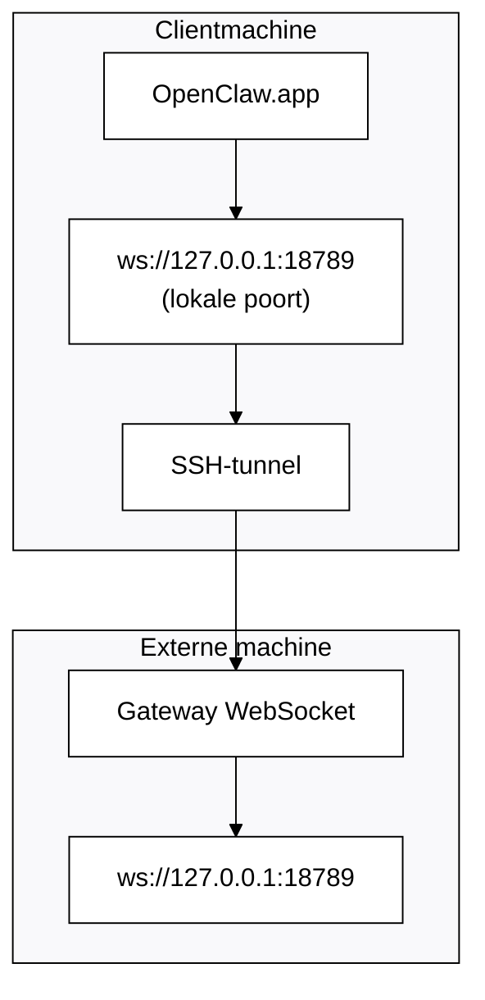

# OpenClaw.app uitvoeren met een Remote Gateway

OpenClaw.app gebruikt SSH-tunneling om verbinding te maken met een externe gateway. Deze gids laat zien hoe je dit instelt.

## Overzicht



## Snelle installatie

### Stap 1: SSH-configuratie toevoegen

Bewerk `~/.ssh/config` en voeg toe:

```ssh
Host remote-gateway
    HostName <REMOTE_IP>          # e.g., 172.27.187.184
    User <REMOTE_USER>            # e.g., jefferson
    LocalForward 18789 127.0.0.1:18789
    IdentityFile ~/.ssh/id_rsa
```

Vervang `<REMOTE_IP>` en `<REMOTE_USER>` door je eigen waarden.

### Stap 2: SSH-sleutel kopiëren

Kopieer je publieke sleutel naar de externe machine (voer het wachtwoord één keer in):

```bash
ssh-copy-id -i ~/.ssh/id_rsa <REMOTE_USER>@<REMOTE_IP>
```

### Stap 3: Gateway-token instellen

```bash
launchctl setenv OPENCLAW_GATEWAY_TOKEN "<your-token>"
```

### Stap 4: SSH-tunnel starten

```bash
ssh -N remote-gateway &
```

### Stap 5: OpenClaw.app opnieuw starten

```bash
# Quit OpenClaw.app (⌘Q), then reopen:
open /path/to/OpenClaw.app
```

De app maakt nu verbinding met de externe gateway via de SSH-tunnel.

---

## Tunnel automatisch starten bij inloggen

Om de SSH-tunnel automatisch te laten starten wanneer je inlogt, maak je een Launch Agent aan.

### Het PLIST-bestand maken

Sla dit op als `~/Library/LaunchAgents/bot.molt.ssh-tunnel.plist`:

```xml
<?xml version="1.0" encoding="UTF-8"?>
<!DOCTYPE plist PUBLIC "-//Apple//DTD PLIST 1.0//EN" "http://www.apple.com/DTDs/PropertyList-1.0.dtd">
<plist version="1.0">
<dict>
    <key>Label</key>
    <string>bot.molt.ssh-tunnel</string>
    <key>ProgramArguments</key>
    <array>
        <string>/usr/bin/ssh</string>
        <string>-N</string>
        <string>remote-gateway</string>
    </array>
    <key>KeepAlive</key>
    <true/>
    <key>RunAtLoad</key>
    <true/>
</dict>
</plist>
```

### De Launch Agent laden

```bash
launchctl bootstrap gui/$UID ~/Library/LaunchAgents/bot.molt.ssh-tunnel.plist
```

De tunnel zal nu:

- Automatisch starten wanneer je inlogt
- Opnieuw starten als deze crasht
- Op de achtergrond blijven draaien

Legacy-opmerking: verwijder eventuele overgebleven `com.openclaw.ssh-tunnel` LaunchAgent indien aanwezig.

---

## Problemen oplossen

**Controleren of de tunnel draait:**

```bash
ps aux | grep "ssh -N remote-gateway" | grep -v grep
lsof -i :18789
```

**De tunnel herstarten:**

```bash
launchctl kickstart -k gui/$UID/bot.molt.ssh-tunnel
```

**De tunnel stoppen:**

```bash
launchctl bootout gui/$UID/bot.molt.ssh-tunnel
```

---

## Hoe het werkt

| Component                            | Wat het doet                                                                                 |
| ------------------------------------ | -------------------------------------------------------------------------------------------- |
| `LocalForward 18789 127.0.0.1:18789` | Stuurt lokale poort 18789 door naar externe poort 18789                                      |
| `ssh -N`                             | SSH zonder het uitvoeren van externe opdrachten (alleen poortdoorsturing) |
| `KeepAlive`                          | Start de tunnel automatisch opnieuw als deze crasht                                          |
| `RunAtLoad`                          | Start de tunnel wanneer de agent wordt geladen                                               |

OpenClaw.app maakt verbinding met `ws://127.0.0.1:18789` op je clientmachine. De SSH-tunnel stuurt die verbinding door naar poort 18789 op de externe machine waar de Gateway draait.
