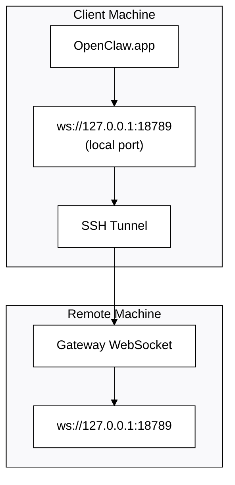

# Uruchamianie OpenClaw.app ze zdalnym Gateway

OpenClaw.app używa tunelowania SSH do łączenia się ze zdalnym gateway. Ten przewodnik pokazuje, jak to skonfigurować.

## Przegląd



## Szybka konfiguracja

### Krok 1: Dodaj konfigurację SSH

Edytuj `~/.ssh/config` i dodaj:

```ssh
Host remote-gateway
    HostName <REMOTE_IP>          # e.g., 172.27.187.184
    User <REMOTE_USER>            # e.g., jefferson
    LocalForward 18789 127.0.0.1:18789
    IdentityFile ~/.ssh/id_rsa
```

Zastąp `<REMOTE_IP>` oraz `<REMOTE_USER>` własnymi wartościami.

### Krok 2: Skopiuj klucz SSH

Skopiuj swój klucz publiczny na zdalną maszynę (wprowadź hasło jednorazowo):

```bash
ssh-copy-id -i ~/.ssh/id_rsa <REMOTE_USER>@<REMOTE_IP>
```

### Krok 3: Ustaw token Gateway

```bash
launchctl setenv OPENCLAW_GATEWAY_TOKEN "<your-token>"
```

### Krok 4: Uruchom tunel SSH

```bash
ssh -N remote-gateway &
```

### Krok 5: Uruchom ponownie OpenClaw.app

```bash
# Quit OpenClaw.app (⌘Q), then reopen:
open /path/to/OpenClaw.app
```

Aplikacja połączy się teraz ze zdalnym gateway przez tunel SSH.

---

## Automatyczne uruchamianie tunelu przy logowaniu

Aby tunel SSH uruchamiał się automatycznie po zalogowaniu, utwórz agenta uruchamiania (Launch Agent).

### Utwórz plik PLIST

Zapisz to jako `~/Library/LaunchAgents/bot.molt.ssh-tunnel.plist`:

```xml
<?xml version="1.0" encoding="UTF-8"?>
<!DOCTYPE plist PUBLIC "-//Apple//DTD PLIST 1.0//EN" "http://www.apple.com/DTDs/PropertyList-1.0.dtd">
<plist version="1.0">
<dict>
    <key>Label</key>
    <string>bot.molt.ssh-tunnel</string>
    <key>ProgramArguments</key>
    <array>
        <string>/usr/bin/ssh</string>
        <string>-N</string>
        <string>remote-gateway</string>
    </array>
    <key>KeepAlive</key>
    <true/>
    <key>RunAtLoad</key>
    <true/>
</dict>
</plist>
```

### Załaduj Launch Agent

```bash
launchctl bootstrap gui/$UID ~/Library/LaunchAgents/bot.molt.ssh-tunnel.plist
```

Tunel będzie teraz:

- Uruchamiany automatycznie po zalogowaniu
- Restartowany w przypadku awarii
- Działał w tle

Uwaga dotycząca starszych konfiguracji: usuń wszelkie pozostałe LaunchAgent `com.openclaw.ssh-tunnel`, jeśli istnieją.

---

## Rozwiązywanie problemów

**Sprawdź, czy tunel działa:**

```bash
ps aux | grep "ssh -N remote-gateway" | grep -v grep
lsof -i :18789
```

**Uruchom ponownie tunel:**

```bash
launchctl kickstart -k gui/$UID/bot.molt.ssh-tunnel
```

**Zatrzymaj tunel:**

```bash
launchctl bootout gui/$UID/bot.molt.ssh-tunnel
```

---

## Jak to działa

| Komponent                            | Co robi                                                                               |
| ------------------------------------ | ------------------------------------------------------------------------------------- |
| `LocalForward 18789 127.0.0.1:18789` | Przekierowuje lokalny port 18789 na zdalny port 18789                                 |
| `ssh -N`                             | SSH bez wykonywania zdalnych poleceń (tylko przekierowanie portów) |
| `KeepAlive`                          | Automatycznie restartuje tunel w razie awarii                                         |
| `RunAtLoad`                          | Uruchamia tunel podczas ładowania agenta                                              |

OpenClaw.app łączy się z `ws://127.0.0.1:18789` na Twojej maszynie klienckiej. Tunel SSH przekazuje to połączenie do portu 18789 na zdalnej maszynie, na której działa Gateway.
