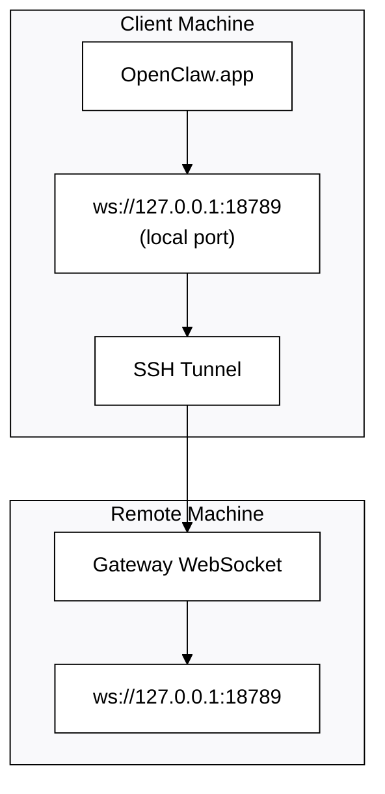

# Запуск OpenClaw.app с удалённым Gateway (шлюзом)

OpenClaw.app использует SSH-туннелирование для подключения к удалённому Gateway (шлюзу). В этом руководстве показано, как выполнить настройку.

## Обзор



## Быстрая настройка

### Шаг 1: Добавьте конфигурацию SSH

Отредактируйте `~/.ssh/config` и добавьте:

```ssh
Host remote-gateway
    HostName <REMOTE_IP>          # e.g., 172.27.187.184
    User <REMOTE_USER>            # e.g., jefferson
    LocalForward 18789 127.0.0.1:18789
    IdentityFile ~/.ssh/id_rsa
```

Замените `<REMOTE_IP>` и `<REMOTE_USER>` на ваши значения.

### Шаг 2: Скопируйте SSH-ключ

Скопируйте ваш публичный ключ на удалённую машину (введите пароль один раз):

```bash
ssh-copy-id -i ~/.ssh/id_rsa <REMOTE_USER>@<REMOTE_IP>
```

### Шаг 3: Установите токен Gateway (шлюза)

```bash
launchctl setenv OPENCLAW_GATEWAY_TOKEN "<your-token>"
```

### Шаг 4: Запустите SSH-туннель

```bash
ssh -N remote-gateway &
```

### Шаг 5: Перезапустите OpenClaw.app

```bash
# Quit OpenClaw.app (⌘Q), then reopen:
open /path/to/OpenClaw.app
```

Теперь приложение будет подключаться к удалённому Gateway (шлюзу) через SSH-туннель.

---

## Автозапуск туннеля при входе в систему

Чтобы SSH-туннель запускался автоматически при входе в систему, создайте Launch Agent.

### Создайте файл PLIST

Сохраните это как `~/Library/LaunchAgents/bot.molt.ssh-tunnel.plist`:

```xml
<?xml version="1.0" encoding="UTF-8"?>
<!DOCTYPE plist PUBLIC "-//Apple//DTD PLIST 1.0//EN" "http://www.apple.com/DTDs/PropertyList-1.0.dtd">
<plist version="1.0">
<dict>
    <key>Label</key>
    <string>bot.molt.ssh-tunnel</string>
    <key>ProgramArguments</key>
    <array>
        <string>/usr/bin/ssh</string>
        <string>-N</string>
        <string>remote-gateway</string>
    </array>
    <key>KeepAlive</key>
    <true/>
    <key>RunAtLoad</key>
    <true/>
</dict>
</plist>
```

### Загрузите Launch Agent

```bash
launchctl bootstrap gui/$UID ~/Library/LaunchAgents/bot.molt.ssh-tunnel.plist
```

Теперь туннель будет:

- Запускаться автоматически при входе в систему
- Перезапустить, если он падает
- Работать в фоновом режиме

Примечание для устаревших конфигураций: при наличии удалите любой оставшийся LaunchAgent `com.openclaw.ssh-tunnel`.

---

## Устранение неполадок

**Проверьте, запущен ли туннель:**

```bash
ps aux | grep "ssh -N remote-gateway" | grep -v grep
lsof -i :18789
```

**Перезапустите туннель:**

```bash
launchctl kickstart -k gui/$UID/bot.molt.ssh-tunnel
```

**Остановите туннель:**

```bash
launchctl bootout gui/$UID/bot.molt.ssh-tunnel
```

---

## Как это работает

| Компонент                            | Что он делает                                                                  |
| ------------------------------------ | ------------------------------------------------------------------------------ |
| `LocalForward 18789 127.0.0.1:18789` | Перенаправляет локальный порт 18789 на удалённый порт 18789                    |
| `ssh -N`                             | SSH без выполнения удалённых команд (только проброс портов) |
| `KeepAlive`                          | Автоматически перезапускает туннель при сбое                                   |
| `RunAtLoad`                          | Запускает туннель при загрузке агента                                          |

OpenClaw.app подключается к `ws://127.0.0.1:18789` на вашей клиентской машине. SSH-туннель перенаправляет это подключение на порт 18789 на удалённой машине, где запущен Gateway (шлюз).
