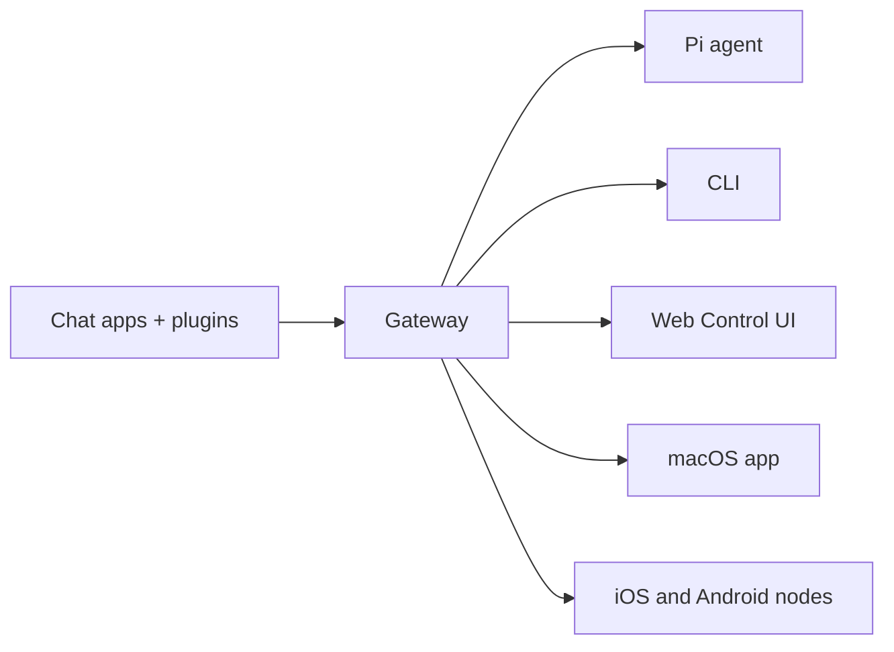

# OpenClaw 🦞

<p align="center">
    
    
</p>

> _"EXFOLIATE! EXFOLIATE!"_ — ehtimol, kosmik omar

<p align="center"><strong>WhatsApp, Telegram, Discord, iMessage va boshqalar bo‘ylab AI agentlari uchun har qanday OS gateway.</strong><br />
  Xabar yuboring, cho‘ntagingizdan agent javobini oling. Plaginlar Mattermost va boshqalarni qo‘shadi.
</p>

<Columns>
  <Card title="Get Started" href="/start/getting-started" icon="rocket">    OpenClaw’ni o‘rnating va Gateway’ni bir necha daqiqada ishga tushiring.
  </Card>
  <Card title="Run the Wizard" href="/start/wizard" icon="sparkles"> 
    `openclaw onboard` va juftlash jarayonlari bilan boshqariladigan sozlash.
  </Card>
  <Card title="Open the Control UI" href="/web/control-ui" icon="layout-dashboard"> 
    Chat, konfiguratsiya va sessiyalar uchun brauzer boshqaruv panelini ishga tushiring.
  </Card>
</Columns>

## OpenClaw nima?

OpenClaw — sevimli chat ilovalaringizni — WhatsApp, Telegram, Discord, iMessage va boshqalarni — Pi kabi AI kodlash agentlari bilan bog‘laydigan **o‘z-o‘zini xost qilinadigan shlyuz**. Siz o‘z kompyuteringizda (yoki serverda) bitta Gateway jarayonini ishga tushirasiz va u xabar almashish ilovalaringiz bilan doimiy mavjud AI yordamchi o‘rtasidagi ko‘prikka aylanadi.

**Kimlar uchun?** Ma’lumotlari ustidan nazoratni yo‘qotmasdan yoki xostlangan xizmatlarga tayanmasdan, istalgan joydan xabar yuborib foydalaniladigan shaxsiy AI yordamchini xohlaydigan dasturchilar va ilg‘or foydalanuvchilar uchun.

**Uni nimasi bilan boshqacha?**

- **O‘z-o‘zini xost qilinadi**: sizning uskunangizda, sizning qoidalaringiz bilan ishlaydi
- **Ko‘p kanalli**: bitta Gateway bir vaqtning o‘zida WhatsApp, Telegram, Discord va boshqalarga xizmat qiladi
- **Agentga mos**: vositalardan foydalanish, sessiyalar, xotira va ko‘p agentli marshrutlashga ega kodlash agentlari uchun yaratilgan
- **Ochiq manbali**: MIT litsenziyasi, hamjamiyat tomonidan rivojlantiriladi

**Nimalar kerak?** Node 22+, API kaliti (Anthropic tavsiya etiladi) va 5 daqiqa.

## Qanday ishlaydi



Gateway sessiyalar, marshrutlash va kanal ulanishlari uchun yagona haqiqat manbaidir.

## Asosiy imkoniyatlar

<Columns>
  <Card title="Multi-channel gateway" icon="network"> 
    Bitta Gateway jarayoni bilan WhatsApp, Telegram, Discord va iMessage.
  </Card>
  <Card title="Plugin channels" icon="plug"> 
    Kengaytma paketlari orqali Mattermost va boshqalarni qo‘shing.
  </Card>
  <Card title="Multi-agent routing" icon="route"> 
    Har bir agent, ish maydoni yoki jo‘natuvchi uchun alohida sessiyalar.
  </Card>
  <Card title="Media support" icon="image"> 
    Rasm, audio va hujjatlarni yuborish va qabul qilish.
  </Card>
  <Card title="Web Control UI" icon="monitor"> 
    Chat, konfiguratsiya, sessiyalar va tugunlar uchun brauzer boshqaruv paneli.
  </Card>
  <Card title="Mobile nodes" icon="smartphone"> 
    Canvas qo‘llab-quvvatlovi bilan iOS va Android tugunlarini juftlash.
  </Card>
</Columns>

## Tezkor boshlash

<Steps>
  <Step title="Install OpenClaw"> 
    ```bash
    npm install -g openclaw@latest
    ```
  </Step>
  <Step title="Onboard and install the service"> 
    ```bash
    openclaw onboard --install-daemon
    ```
  </Step>
  <Step title="Pair WhatsApp and start the Gateway"> 
    ```bash
    openclaw channels login
    openclaw gateway --port 18789
    ```
  </Step>
</Steps>

To‘liq o‘rnatish va ishlab chiqish sozlamalari kerakmi? [Quick start](/start/quickstart) ga qarang.

## Boshqaruv paneli

Gateway ishga tushgach, brauzer Control UI’ni oching.

- Mahalliy sukut bo‘yicha: [http://127.0.0.1:18789/](http://127.0.0.1:18789/)
- Masofaviy kirish: [Web surfaces](/web) va [Tailscale](/gateway/tailscale)

<p align="center">
  
</p>

## Configuration (optional)

Konfiguratsiya `~/.openclaw/openclaw.json` da joylashgan.

- If you **do nothing**, OpenClaw uses the bundled Pi binary in RPC mode with per-sender sessions.
- If you want to lock it down, start with `channels.whatsapp.allowFrom` and (for groups) mention rules.

Misol:

```json5
{
  channels: {
    whatsapp: {
      allowFrom: ["+15555550123"],
      groups: { "*": { requireMention: true } },
    },
  },
  messages: { groupChat: { mentionPatterns: ["@openclaw"] } },
}
```

## Start here

<Columns>
  <Card title="Docs hubs" href="/start/hubs" icon="book-open">
    All docs and guides, organized by use case.
  </Card>
  <Card title="Configuration" href="/gateway/configuration" icon="settings">
    Core Gateway settings, tokens, and provider config.
  </Card>
  <Card title="Remote access" href="/gateway/remote" icon="globe">
    SSH and tailnet access patterns.
  </Card>
  <Card title="Channels" href="/channels/telegram" icon="message-square">
    Channel-specific setup for WhatsApp, Telegram, Discord, and more.
  </Card>
  <Card title="Nodes" href="/nodes" icon="smartphone">Juftlash va Canvas bilan iOS va Android tugunlari.</Card>
  <Card title="Help" href="/help" icon="life-buoy">
    Common fixes and troubleshooting entry point.
  </Card>
</Columns>

## Batafsil ma’lumot

<Columns>
  <Card title="Full feature list" href="/concepts/features" icon="list">
    Complete channel, routing, and media capabilities.
  </Card>
  <Card title="Multi-agent routing" href="/concepts/multi-agent" icon="route">
    Workspace isolation and per-agent sessions.
  </Card>
  <Card title="Security" href="/gateway/security" icon="shield">
    Tokens, allowlists, and safety controls.
  </Card>
  <Card title="Troubleshooting" href="/gateway/troubleshooting" icon="wrench">
    Gateway diagnostics and common errors.
  </Card>
  <Card title="About and credits" href="/reference/credits" icon="info">
    Project origins, contributors, and license.
  </Card>
</Columns>
