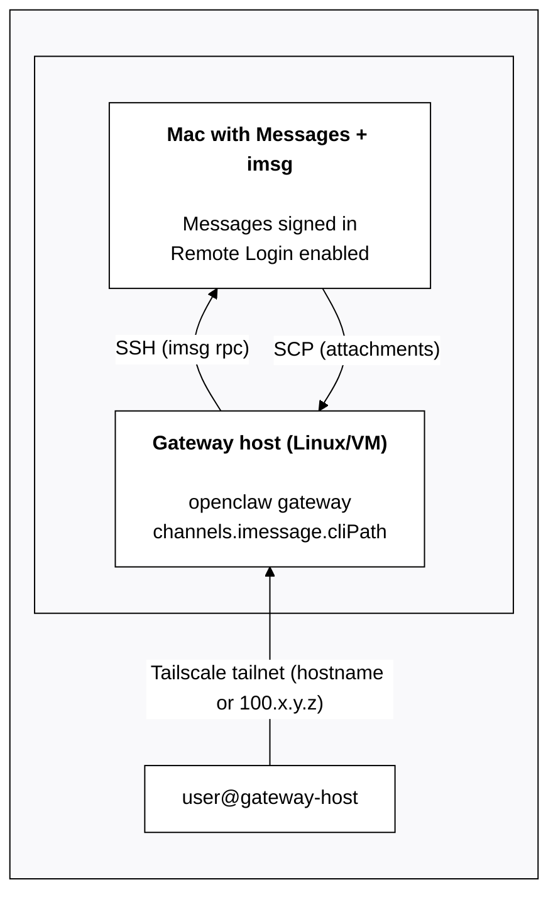

# 26. iMessage（旧版：imsg）

> 27. **推荐：** 新的 iMessage 部署请使用 [BlueBubbles](/channels/bluebubbles)。
>
> 28. `imsg` 通道是一个旧的外部 CLI 集成，可能会在未来版本中移除。

29. 状态：旧的外部 CLI 集成。 30. 网关会启动 `imsg rpc`（基于 stdio 的 JSON-RPC）。

## 31. 快速设置（新手）

1. 32. 确保此 Mac 上的“信息”已登录。
2. 33. 安装 `imsg`：
   - 34. `brew install steipete/tap/imsg`
3. 35. 使用 `channels.imessage.cliPath` 和 `channels.imessage.dbPath` 配置 OpenClaw。
4. 36. 启动网关并批准任何 macOS 提示（自动化 + 完全磁盘访问）。

37) 最小配置：

```json5
38. {
  channels: {
    imessage: {
      enabled: true,
      cliPath: "/usr/local/bin/imsg",
      dbPath: "/Users/<you>/Library/Messages/chat.db",
    },
  },
}
```

## 39. 是什么

- 40. 由 macOS 上的 `imsg` 支持的 iMessage 通道。
- 41. 确定性路由：回复始终返回到 iMessage。
- 42. 私聊共享代理的主会话；群组是隔离的（`agent:<agentId>:imessage:group:<chat_id>`）。
- 43. 如果一个多参与者线程以 `is_group=false` 到达，仍可通过 `channels.imessage.groups` 按 `chat_id` 将其隔离（见下文“类群组线程”）。

## 44. 配置写入

45. 默认情况下，iMessage 允许写入由 `/config set|unset` 触发的配置更新（需要 `commands.config: true`）。

46. 可通过以下方式禁用：

```json5
47. {
  channels: { imessage: { configWrites: false } },
}
```

## 48. 要求

- 49. 已登录“信息”的 macOS。
- 50. 为 OpenClaw + `imsg` 授予完全磁盘访问权限（访问“信息”数据库）。
- Automation permission when sending.
- `channels.imessage.cliPath` can point to any command that proxies stdin/stdout (for example, a wrapper script that SSHes to another Mac and runs `imsg rpc`).

## Troubleshooting macOS Privacy and Security TCC

If sending/receiving fails (for example, `imsg rpc` exits non-zero, times out, or the gateway appears to hang), a common cause is a macOS permission prompt that was never approved.

macOS grants TCC permissions per app/process context. Approve prompts in the same context that runs `imsg` (for example, Terminal/iTerm, a LaunchAgent session, or an SSH-launched process).

Checklist:

- **Full Disk Access**: allow access for the process running OpenClaw (and any shell/SSH wrapper that executes `imsg`). 9. 这是读取 Messages 数据库（`chat.db`）所必需的。
- **Automation → Messages**: allow the process running OpenClaw (and/or your terminal) to control **Messages.app** for outbound sends.
- **`imsg` CLI health**: verify `imsg` is installed and supports RPC (`imsg rpc --help`).

Tip: If OpenClaw is running headless (LaunchAgent/systemd/SSH) the macOS prompt can be easy to miss. Run a one-time interactive command in a GUI terminal to force the prompt, then retry:

```bash
imsg chats --limit 1
# or
imsg send <handle> "test"
```

Related macOS folder permissions (Desktop/Documents/Downloads): [/platforms/mac/permissions](/platforms/mac/permissions).

## Setup (fast path)

1. 10. 确保此 Mac 上的 Messages 已登录。
2. Configure iMessage and start the gateway.

### Dedicated bot macOS user (for isolated identity)

11. 如果你希望机器人使用**单独的 iMessage 身份**发送（并保持你的个人 Messages 干净），请使用一个专用的 Apple ID + 一个专用的 macOS 用户。

1. Create a dedicated Apple ID (example: `my-cool-bot@icloud.com`).
   - Apple may require a phone number for verification / 2FA.
2. Create a macOS user (example: `openclawhome`) and sign into it.
3. Open Messages in that macOS user and sign into iMessage using the bot Apple ID.
4. Enable Remote Login (System Settings → General → Sharing → Remote Login).
5. Install `imsg`:
   - `brew install steipete/tap/imsg`
6. Set up SSH so `ssh <bot-macos-user>@localhost true` works without a password.
7. Point `channels.imessage.accounts.bot.cliPath` at an SSH wrapper that runs `imsg` as the bot user.

First-run note: sending/receiving may require GUI approvals (Automation + Full Disk Access) in the _bot macOS user_. If `imsg rpc` looks stuck or exits, log into that user (Screen Sharing helps), run a one-time `imsg chats --limit 1` / `imsg send ...`, approve prompts, then retry. See [Troubleshooting macOS Privacy and Security TCC](#troubleshooting-macos-privacy-and-security-tcc).

Example wrapper (`chmod +x`). Replace `<bot-macos-user>` with your actual macOS username:

```bash
#!/usr/bin/env bash
set -euo pipefail

# Run an interactive SSH once first to accept host keys:
#   ssh <bot-macos-user>@localhost true
exec /usr/bin/ssh -o BatchMode=yes -o ConnectTimeout=5 -T <bot-macos-user>@localhost \
  "/usr/local/bin/imsg" "$@"
```

Example config:

```json5
{
  channels: {
    imessage: {
      enabled: true,
      accounts: {
        bot: {
          name: "Bot",
          enabled: true,
          cliPath: "/path/to/imsg-bot",
          dbPath: "/Users/<bot-macos-user>/Library/Messages/chat.db",
        },
      },
    },
  },
}
```

For single-account setups, use flat options (`channels.imessage.cliPath`, `channels.imessage.dbPath`) instead of the `accounts` map.

### Remote/SSH variant (optional)

If you want iMessage on another Mac, set `channels.imessage.cliPath` to a wrapper that runs `imsg` on the remote macOS host over SSH. OpenClaw only needs stdio.

Example wrapper:

```bash
#!/usr/bin/env bash
exec ssh -T gateway-host imsg "$@"
```

**Remote attachments:** When `cliPath` points to a remote host via SSH, attachment paths in the Messages database reference files on the remote machine. OpenClaw can automatically fetch these over SCP by setting `channels.imessage.remoteHost`:

```json5
{
  channels: {
    imessage: {
      cliPath: "~/imsg-ssh", // SSH wrapper to remote Mac
      remoteHost: "user@gateway-host", // for SCP file transfer
      includeAttachments: true,
    },
  },
}
```

If `remoteHost` is not set, OpenClaw attempts to auto-detect it by parsing the SSH command in your wrapper script. Explicit configuration is recommended for reliability.

#### Remote Mac via Tailscale (example)

If the Gateway runs on a Linux host/VM but iMessage must run on a Mac, Tailscale is the simplest bridge: the Gateway talks to the Mac over the tailnet, runs `imsg` via SSH, and SCPs attachments back.

Architecture:



Concrete config example (Tailscale hostname):

```json5
{
  channels: {
    imessage: {
      enabled: true,
      cliPath: "~/.openclaw/scripts/imsg-ssh",
      remoteHost: "bot@mac-mini.tailnet-1234.ts.net",
      includeAttachments: true,
      dbPath: "/Users/bot/Library/Messages/chat.db",
    },
  },
}
```

Example wrapper (`~/.openclaw/scripts/imsg-ssh`):

```bash
#!/usr/bin/env bash
exec ssh -T bot@mac-mini.tailnet-1234.ts.net imsg "$@"
```

Notes:

- Ensure the Mac is signed in to Messages, and Remote Login is enabled.
- Use SSH keys so `ssh bot@mac-mini.tailnet-1234.ts.net` works without prompts.
- `remoteHost` should match the SSH target so SCP can fetch attachments.

Multi-account support: use `channels.imessage.accounts` with per-account config and optional `name`. See [`gateway/configuration`](/gateway/configuration#telegramaccounts--discordaccounts--slackaccounts--signalaccounts--imessageaccounts) for the shared pattern. Don't commit `~/.openclaw/openclaw.json` (it often contains tokens).

## Access control (DMs + groups)

DMs:

- Default: `channels.imessage.dmPolicy = "pairing"`.
- Unknown senders receive a pairing code; messages are ignored until approved (codes expire after 1 hour).
- Approve via:
  - `openclaw pairing list imessage`
  - `openclaw pairing approve imessage <CODE>`
- Pairing is the default token exchange for iMessage DMs. 12. 详情：[Pairing](/channels/pairing)

Groups:

- `channels.imessage.groupPolicy = open | allowlist | disabled`.
- `channels.imessage.groupAllowFrom` controls who can trigger in groups when `allowlist` is set.
- Mention gating uses `agents.list[].groupChat.mentionPatterns` (or `messages.groupChat.mentionPatterns`) because iMessage has no native mention metadata.
- Multi-agent override: set per-agent patterns on `agents.list[].groupChat.mentionPatterns`.

## How it works (behavior)

- `imsg` streams message events; the gateway normalizes them into the shared channel envelope.
- Replies always route back to the same chat id or handle.

## Group-ish threads (`is_group=false`)

Some iMessage threads can have multiple participants but still arrive with `is_group=false` depending on how Messages stores the chat identifier.

If you explicitly configure a `chat_id` under `channels.imessage.groups`, OpenClaw treats that thread as a “group” for:

- session isolation (separate `agent:<agentId>:imessage:group:<chat_id>` session key)
- group allowlisting / mention gating behavior

Example:

```json5
{
  channels: {
    imessage: {
      groupPolicy: "allowlist",
      groupAllowFrom: ["+15555550123"],
      groups: {
        "42": { requireMention: false },
      },
    },
  },
}
```

This is useful when you want an isolated personality/model for a specific thread (see [Multi-agent routing](/concepts/multi-agent)). For filesystem isolation, see [Sandboxing](/gateway/sandboxing).

## Media + limits

- Optional attachment ingestion via `channels.imessage.includeAttachments`.
- Media cap via `channels.imessage.mediaMaxMb`.

## Limits

- Outbound text is chunked to `channels.imessage.textChunkLimit` (default 4000).
- Optional newline chunking: set `channels.imessage.chunkMode="newline"` to split on blank lines (paragraph boundaries) before length chunking.
- Media uploads are capped by `channels.imessage.mediaMaxMb` (default 16).

## Addressing / delivery targets

Prefer `chat_id` for stable routing:

- `chat_id:123` (preferred)
- `chat_guid:...`
- `chat_identifier:...`
- 1. 直接句柄：`imessage:+1555` / `sms:+1555` / `user@example.com`

2. 列出聊天：

```
3. imsg chats --limit 20
```

## 4. 配置参考（iMessage）

5. 完整配置：[Configuration](/gateway/configuration)

6. 提供方选项：

- 7. `channels.imessage.enabled`：启用/禁用频道启动。
- 8. `channels.imessage.cliPath`：`imsg` 的路径。
- 9. `channels.imessage.dbPath`：消息数据库路径。
- 10. `channels.imessage.remoteHost`：当 `cliPath` 指向远程 Mac 时，用于通过 SCP 传输附件的 SSH 主机（例如：`user@gateway-host`）。 11. 若未设置，将从 SSH 包装器中自动检测。
- 12. `channels.imessage.service`：`imessage | sms | auto`。
- 13. `channels.imessage.region`：短信区域。
- 14. `channels.imessage.dmPolicy`：`pairing | allowlist | open | disabled`（默认：pairing）。
- 15. `channels.imessage.allowFrom`：私聊允许列表（句柄、邮箱、E.164 号码，或 `chat_id:*`）。 16. `open` 需要使用 `"*"`。 17. iMessage 没有用户名；请使用句柄或聊天目标。
- 18. `channels.imessage.groupPolicy`：`open | allowlist | disabled`（默认：allowlist）。
- 19. `channels.imessage.groupAllowFrom`：群组发送者允许列表。
- 20. `channels.imessage.historyLimit` / `channels.imessage.accounts.*.historyLimit`：作为上下文包含的最大群消息数（0 表示禁用）。
- 21. `channels.imessage.dmHistoryLimit`：以用户轮次计的私聊历史上限。 22. 按用户覆盖：`channels.imessage.dms["<handle>"].historyLimit`。
- 23. `channels.imessage.groups`：按群组的默认设置 + 允许列表（使用 `"*"` 作为全局默认）。
- 24. `channels.imessage.includeAttachments`：将附件摄入到上下文中。
- 25. `channels.imessage.mediaMaxMb`：入站/出站媒体大小上限（MB）。
- 26. `channels.imessage.textChunkLimit`：出站分块大小（字符数）。
- 27. `channels.imessage.chunkMode`：`length`（默认）或 `newline`，在按长度分块前先按空行（段落边界）拆分。

28. 相关的全局选项：

- 29. `agents.list[].groupChat.mentionPatterns`（或 `messages.groupChat.mentionPatterns`）。
- 30. `messages.responsePrefix`。
