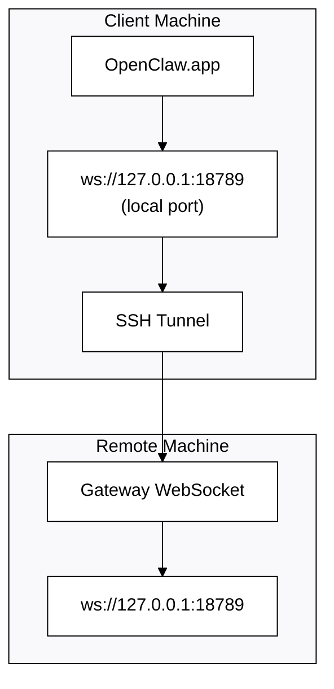

# 使用远程网关运行 OpenClaw.app

OpenClaw.app 使用 SSH 隧道连接到远程网关。 本指南将向你展示如何进行设置。

## 概述



## 快速设置

### Step 1: Add SSH Config

Edit `~/.ssh/config` and add:

```ssh
Host remote-gateway
    HostName <REMOTE_IP>          # e.g., 172.27.187.184
    User <REMOTE_USER>            # e.g., jefferson
    LocalForward 18789 127.0.0.1:18789
    IdentityFile ~/.ssh/id_rsa
```

Replace `<REMOTE_IP>` and `<REMOTE_USER>` with your values.

### Step 2: Copy SSH Key

Copy your public key to the remote machine (enter password once):

```bash
ssh-copy-id -i ~/.ssh/id_rsa <REMOTE_USER>@<REMOTE_IP>
```

### Step 3: Set Gateway Token

```bash
launchctl setenv OPENCLAW_GATEWAY_TOKEN "<your-token>"
```

### Step 4: Start SSH Tunnel

```bash
ssh -N remote-gateway &
```

### Step 5: Restart OpenClaw.app

```bash
# Quit OpenClaw.app (⌘Q), then reopen:
open /path/to/OpenClaw.app
```

应用现在将通过 SSH 隧道连接到远程网关。

---

## Auto-Start Tunnel on Login

To have the SSH tunnel start automatically when you log in, create a Launch Agent.

### Create the PLIST file

Save this as `~/Library/LaunchAgents/bot.molt.ssh-tunnel.plist`:

```xml
<?xml version="1.0" encoding="UTF-8"?>
<!DOCTYPE plist PUBLIC "-//Apple//DTD PLIST 1.0//EN" "http://www.apple.com/DTDs/PropertyList-1.0.dtd">
<plist version="1.0">
<dict>
    <key>Label</key>
    <string>bot.molt.ssh-tunnel</string>
    <key>ProgramArguments</key>
    <array>
        <string>/usr/bin/ssh</string>
        <string>-N</string>
        <string>remote-gateway</string>
    </array>
    <key>KeepAlive</key>
    <true/>
    <key>RunAtLoad</key>
    <true/>
</dict>
</plist>
```

### Load the Launch Agent

```bash
launchctl bootstrap gui/$UID ~/Library/LaunchAgents/bot.molt.ssh-tunnel.plist
```

The tunnel will now:

- Start automatically when you log in
- Restart if it crashes
- Keep running in the background

Legacy note: remove any leftover `com.openclaw.ssh-tunnel` LaunchAgent if present.

---

## Troubleshooting

**Check if tunnel is running:**

```bash
ps aux | grep "ssh -N remote-gateway" | grep -v grep
lsof -i :18789
```

**Restart the tunnel:**

```bash
launchctl kickstart -k gui/$UID/bot.molt.ssh-tunnel
```

**Stop the tunnel:**

```bash
launchctl bootout gui/$UID/bot.molt.ssh-tunnel
```

---

## How It Works

| Component                            | What It Does                                                                    |
| ------------------------------------ | ------------------------------------------------------------------------------- |
| `LocalForward 18789 127.0.0.1:18789` | Forwards local port 18789 to remote port 18789                                  |
| `ssh -N`                             | SSH without executing remote commands (just port forwarding) |
| `KeepAlive`                          | Automatically restarts tunnel if it crashes                                     |
| `RunAtLoad`                          | 在 agent 加载时启动隧道                                                                 |

OpenClaw.app 会连接到客户端机器上的 `ws://127.0.0.1:18789`。 The SSH tunnel forwards that connection to port 18789 on the remote machine where the Gateway is running.
