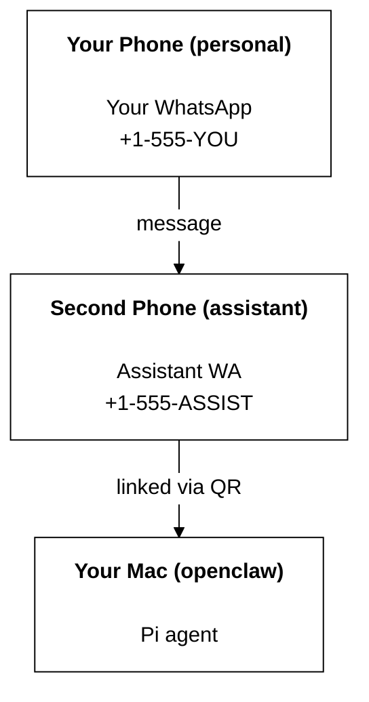

# Building a personal assistant with OpenClaw

OpenClaw is a WhatsApp + Telegram + Discord + iMessage gateway for **Pi** agents. 26. 插件添加了 Mattermost。 This guide is the "personal assistant" setup: one dedicated WhatsApp number that behaves like your always-on agent.

## ⚠️ Safety first

You’re putting an agent in a position to:

- run commands on your machine (depending on your Pi tool setup)
- read/write files in your workspace
- send messages back out via WhatsApp/Telegram/Discord/Mattermost (plugin)

Start conservative:

- Always set `channels.whatsapp.allowFrom` (never run open-to-the-world on your personal Mac).
- Use a dedicated WhatsApp number for the assistant.
- Heartbeats now default to every 30 minutes. Disable until you trust the setup by setting `agents.defaults.heartbeat.every: "0m"`.

## 27. 前置条件

- OpenClaw installed and onboarded — see [Getting Started](/start/getting-started) if you haven't done this yet
- A second phone number (SIM/eSIM/prepaid) for the assistant

## 28. 双手机设置（推荐）

You want this:



If you link your personal WhatsApp to OpenClaw, every message to you becomes “agent input”. That’s rarely what you want.

## 5-minute quick start

1. Pair WhatsApp Web (shows QR; scan with the assistant phone):

```bash
openclaw channels login
```

2. Start the Gateway (leave it running):

```bash
openclaw gateway --port 18789
```

3. Put a minimal config in `~/.openclaw/openclaw.json`:

```json5
{
  channels: { whatsapp: { allowFrom: ["+15555550123"] } },
}
```

Now message the assistant number from your allowlisted phone.

When onboarding finishes, we auto-open the dashboard and print a clean (non-tokenized) link. If it prompts for auth, paste the token from `gateway.auth.token` into Control UI settings. To reopen later: `openclaw dashboard`.

## Give the agent a workspace (AGENTS)

OpenClaw reads operating instructions and “memory” from its workspace directory.

1. 默认情况下，OpenClaw 使用 `~/.openclaw/workspace` 作为代理工作区，并会在设置/首次代理运行时自动创建它（以及初始的 `AGENTS.md`、`SOUL.md`、`TOOLS.md`、`IDENTITY.md`、`USER.md`、`HEARTBEAT.md`）。 2. `BOOTSTRAP.md` 只会在工作区是全新的情况下创建（删除后不应再次出现）。 3. `MEMORY.md` 是可选的（不会自动创建）；存在时会在普通会话中加载。 4. 子代理会话只注入 `AGENTS.md` 和 `TOOLS.md`。

5. 提示：将此文件夹视为 OpenClaw 的“记忆”，并把它做成一个 git 仓库（最好是私有的），这样你的 `AGENTS.md` + 记忆文件就能被备份。 6. 如果已安装 git，全新的工作区会自动初始化。

```bash
7. openclaw setup
```

8. 完整的工作区结构 + 备份指南：[Agent workspace](/concepts/agent-workspace)
   记忆工作流：[Memory](/concepts/memory)

9. 可选：使用 `agents.defaults.workspace` 选择不同的工作区（支持 `~`）。

```json5
10. {
  agent: {
    workspace: "~/.openclaw/workspace",
  },
}
```

11. 如果你已经从仓库分发了自己的工作区文件，可以完全禁用 bootstrap 文件创建：

```json5
12. {
  agent: {
    skipBootstrap: true,
  },
}
```

## 29. 将其变成“助手”的配置

14. OpenClaw 默认提供了一个不错的助手配置，但你通常还会想要调整：

- 15. `SOUL.md` 中的人设/指令
- 16. 思考默认值（如需要）
- 30. 心跳（当你信任它之后）

31. 示例：

```json5
19. {
  logging: { level: "info" },
  agent: {
    model: "anthropic/claude-opus-4-6",
    workspace: "~/.openclaw/workspace",
    thinkingDefault: "high",
    timeoutSeconds: 1800,
    // Start with 0; enable later.
    heartbeat: { every: "0m" },
  },
  channels: {
    whatsapp: {
      allowFrom: ["+15555550123"],
      groups: {
        "*": { requireMention: true },
      },
    },
  },
  routing: {
    groupChat: {
      mentionPatterns: ["@openclaw", "openclaw"],
    },
  },
  session: {
    scope: "per-sender",
    resetTriggers: ["/new", "/reset"],
    reset: {
      mode: "daily",
      atHour: 4,
      idleMinutes: 10080,
    },
  },
}
```

## 20. 会话与记忆

- 21. 会话文件：`~/.openclaw/agents/<agentId>/sessions/{{SessionId}}.jsonl`
- 22. 会话元数据（令牌使用量、最后路由等）：`~/.openclaw/agents/<agentId>/sessions/sessions.json`（旧版：`~/.openclaw/sessions/sessions.json`）
- 23. `/new` 或 `/reset` 会为该聊天启动一个全新的会话（可通过 `resetTriggers` 配置）。 32. 如果单独发送，代理会回复一个简短的问候以确认重置。
- 25. `/compact [instructions]` 会压缩会话上下文并报告剩余的上下文预算。

## 26. 心跳（主动模式）

27. 默认情况下，OpenClaw 每 30 分钟运行一次心跳，使用如下提示：
    \`Read HEARTBEAT.md if it exists (workspace context).
28. Follow it strictly.
29. Do not infer or repeat old tasks from prior chats.
30. If nothing needs attention, reply HEARTBEAT_OK.`设置`agents.defaults.heartbeat.every: "0m"`可禁用。 33. 严格遵循它。 32. 如果该文件缺失，心跳仍会运行，由模型决定要做什么。 33. 如果代理回复`HEARTBEAT_OK`（可选地带有很短的填充；见 `agents.defaults.heartbeat.ackMaxChars\`），OpenClaw 会抑制该次心跳的外发投递。

- 34. 心跳会运行完整的代理回合——更短的间隔会消耗更多令牌。
- 35. {
      agent: {
      heartbeat: { every: "30m" },
      },
      }
- 36. 媒体输入与输出
- 37. 入站附件（图片/音频/文档）可通过模板暴露给你的命令：

```json5
38. `{{MediaPath}}`（本地临时文件路径）
```

## 39. `{{MediaUrl}}`（伪 URL）

40. `{{Transcript}}`（如果启用了音频转写）

- 41. 代理的出站附件：在单独一行中包含 `MEDIA:<path-or-url>`（不含空格）。
- 42. 示例：
- 43. 这是截图。
      MEDIA:https://example.com/screenshot.png

44. OpenClaw 会提取这些内容，并将其作为媒体与文本一起发送。 45. 运维清单

```
46. openclaw status          # local status (creds, sessions, queued events)
openclaw status --all    # full diagnosis (read-only, pasteable)
openclaw status --deep   # adds gateway health probes (Telegram + Discord)
openclaw health --json   # gateway health snapshot (WS)
```

47. 日志默认位于 `/tmp/openclaw/`（默认：`openclaw-YYYY-MM-DD.log`）。

## 48. 后续步骤

```bash
49. WebChat：[WebChat](/web/webchat)
```

50. 网关运维：[Gateway runbook](/gateway)

## Next steps

- WebChat: [WebChat](/web/webchat)
- Gateway ops: [Gateway runbook](/gateway)
- Cron + wakeups: [Cron jobs](/automation/cron-jobs)
- macOS menu bar companion: [OpenClaw macOS app](/platforms/macos)
- iOS node app: [iOS app](/platforms/ios)
- Android node app: [Android app](/platforms/android)
- Windows status: [Windows (WSL2)](/platforms/windows)
- 34. Linux 状态：[Linux 应用](/platforms/linux)
- Security: [Security](/gateway/security)
